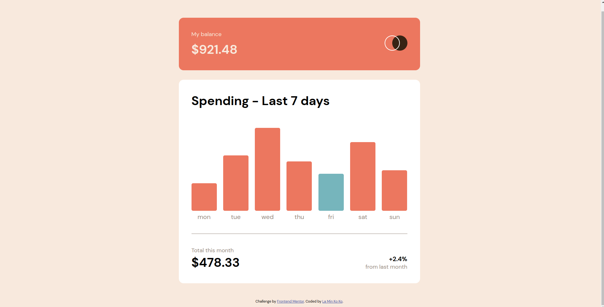

# Frontend Mentor - Expenses chart component solution

This is a solution to the [Expenses chart component challenge on Frontend Mentor](https://www.frontendmentor.io/challenges/expenses-chart-component-e7yJBUdjwt). Frontend Mentor challenges help you improve your coding skills by building realistic projects. 

## Table of contents

- [Overview](#overview)
  - [The challenge](#the-challenge)
  - [Screenshot](#screenshot)
  - [Links](#links)
- [My process](#my-process)
  - [Built with](#built-with)
  - [What I learned](#what-i-learned)
  - [Useful resources](#useful-resources)
- [Author](#author)

## Overview

### The challenge

Users should be able to:

- View the bar chart and hover over the individual bars to see the correct amounts for each day
- See the current day’s bar highlighted in a different colour to the other bars
- View the optimal layout for the content depending on their device’s screen size
- See hover states for all interactive elements on the page
- **Bonus**: Use the JSON data file provided to dynamically size the bars on the chart

### Screenshot



### Links

- Solution URL: [Add solution URL here](https://github.com/laminkoko243/expenses-chart-/)
- Live Site URL: [Add live site URL here](https://laminkoko243.github.io/expenses-chart-/)

## My process

### Built with

- Semantic HTML5 markup
- CSS custom properties
- Flexbox
- jQuery

### What I learned

```js
$.getJSON('file-path', function(){
  // a function
})
```

### Useful resources

- [Live Server VS Code Extension](https://www.youtube.com/watch?v=nx8E5BF0XuE&t=267s) - This helped me for finding solution of can't read local JSON file.

## Author

- Website - [La Min Ko Ko](https://www.laminkoko.com)
- Frontend Mentor - [@laminkoko243](https://www.frontendmentor.io/profile/laminkoko243)
- Twitter - [@laminkoko243](https://twitter.com/laminkoko243)
- Facebook - [@laminkoko243] (https://www.facebook.com/laminkoko243)
- LinkedIn - [@laminkoko] (https://www.linkedin.com/in/laminkoko/)
- Github - [@laminkoko243] (https://github.com/laminkoko243)
